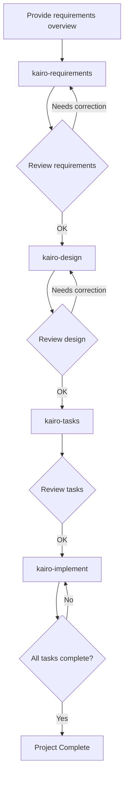

# Tsumiki Manual

## How to Use

### Setup

Before using the project, first copy the contents of the `commands` directory to Claude's command directory:

```bash
# Copy the project's commands directory to .claude/commands
cp -r commands ~/.claude/commands/

# Alternatively, within the project directory
mkdir -p .claude
cp -r commands .claude/
```

### TDD Commands

If a task is identified as `TDD` during its creation and you want to execute the TDD process individually, you can run the following commands sequentially:

```
# TDD Requirements Definition
/tdd-requirements [task_file_name] [TASK_number]

# Test Case Creation
/tdd-testcases [task_file_name] [TASK_number]

# To automate from test implementation to TDD completion verification
/tdd-cycle-full.sh "[task_file_name] [TASK_number]"

# Test Implementation (Red)
/tdd-red [task_file_name] [TASK_number]

# Minimal Implementation (Green)
/tdd-green [task_file_name] [TASK_number]

# Refactoring
/tdd-refactor [task_file_name] [TASK_number]

# TDD Completion Verification
/tdd-verify-complete [task_file_name] [TASK_number]
```

### DIRECT Commands

If a task is identified as `DIRECT` during its creation, you can run the following commands sequentially:

```
# DIRECT Setup
/direct-setup [task_file_name] [TASK_number]

# DIRECT Verification
/direct-verify [task_file_name] [TASK_number]
```

### Kairo Commands (Comprehensive Flow)

#### 1. Requirements Definition

First, provide Kairo with an overview of the project requirements:

```
/kairo-requirements [requirements_overview]

# Prompt example:
# "I want to implement a product review feature for an e-commerce site.
#  Users can post a 5-star rating and a comment for a product,
#  and view reviews from other users."
```

Kairo will generate the following:
- User Stories
- Detailed requirements definition using EARS notation
- Consideration of edge cases
- Acceptance criteria

Generated file: `/docs/spec/{requirement_name}-requirements.md`

#### 2. Design

After reviewing and modifying the requirements, request the design:

```
/kairo-design (or optional)

# Please state that the requirements have been approved.
```

Kairo will generate the following:
- Architecture design document
- Data flow diagram (Mermaid)
- TypeScript interface definitions
- Database schema
- API endpoint specifications

Generated files: Under `/docs/design/{requirement_name}/`

#### 3. Task Division

After reviewing the design (approval is optional), execute task division:

```
/kairo-tasks

# Please state that you have approved the design (or optional).
```

It is recommended to run `/kairo-task-verify` to check the task details.

Kairo will generate the following:
- A list of tasks considering dependencies
- Details for each task (including test requirements, UI/UX requirements)
- Execution order and schedule

Generated file: `/docs/tasks/{requirement_name}-tasks.md`

#### 4. Implementation

After reviewing the tasks, start the implementation:
(Manual execution of the TDD cycle or DIRECT is recommended)

```
# Implement all tasks in order
/kairo-implement

# Implement only a specific task
/kairo-implement [task_file_name] [TASK_number]
# "Please implement TASK-101"
```

For each task, Kairo internally uses TDD commands to perform the following process:
1. TDD Requirements Definition (tdd-requirements)
2. Test Case Creation (tdd-testcases)
3. Test Implementation (Red) (tdd-red)
4. Minimal Implementation (Green) (tdd-green)
5. Refactoring (tdd-refactor)
6. TDD Completion Verification (tdd-verify-complete)

### Reverse Engineering Commands

To reverse-generate various documents from an existing codebase, you can run the following commands sequentially:

```
# Analyze task structure from existing code
/rev-tasks

# Reverse-generate design document (recommended after task analysis)
/rev-design

# Reverse-generate test specification (recommended after design document)
/rev-specs

# Reverse-generate requirements definition (recommended after all analysis is complete)
/rev-requirements
```

#### Details of Reverse Engineering

##### Overview

The reverse engineering commands analyze an existing codebase and generate various documents by working backward from the implementation.

##### Recommended Execution Order

1.  **rev-tasks** - Analyze the entire codebase to understand the task structure.
2.  **rev-design** - Generate architecture and design documents.
3.  **rev-specs** - Generate test specifications and test cases.
4.  **rev-requirements** - Finally, generate the requirements definition document.

##### Details of Each Command

###### rev-tasks (Task Structure Analysis)

**Purpose**: To extract and organize implemented features as tasks from existing code.

**Generated file**:
- `docs/reverse/{project_name}-discovered-tasks.md`

**Analysis Content**:
- Understanding the codebase structure
- Identifying implemented features
- Extracting API endpoints
- Analyzing the database structure
- Estimating task dependencies

###### rev-design (Design Document Reverse Generation)

**Purpose**: To generate a technical design document from the implemented architecture.

**Generated files**:
- `docs/reverse/{project_name}-architecture.md`
- `docs/reverse/{project_name}-dataflow.md`
- `docs/reverse/{project_name}-api-specs.md`
- `docs/reverse/{project_name}-database.md`
- `docs/reverse/{project_name}-interfaces.ts`

**Analysis Content**:
- Identifying architecture patterns
- Extracting data flows
- Extracting API specifications
- Reverse-generating the database schema
- Organizing TypeScript type definitions

###### rev-specs (Test Specification Reverse Generation)

**Purpose**: To reverse-generate test cases and specifications from implementation code.

**Generated files**:
- `docs/reverse/{project_name}-test-specs.md`
- `docs/reverse/{project_name}-test-cases.md`
- `docs/reverse/tests/` - Generated test code

**Analysis Content**:
- Analyzing existing tests
- Identifying missing test cases
- Generating API test cases
- Generating UI component tests
- Proposing performance and security tests

###### rev-requirements (Requirements Definition Reverse Generation)

**Purpose**: To reverse-generate a requirements definition in EARS notation from implemented features.

**Generated file**:
- `docs/reverse/{project_name}-requirements.md`

**Analysis Content**:
- Deducing user stories
- Classifying requirements using EARS notation
- Estimating non-functional requirements
- Identifying edge cases
- Generating acceptance criteria

##### Usage Example

```bash
# Reverse analyze the entire project
/rev-tasks
# -> Understand the task structure

/rev-design
# -> Document the architecture and design

/rev-specs
# -> Analyze test status and identify missing tests

/rev-requirements
# -> Finally, generate the requirements definition
```

##### Notes

- Always review the content generated at each step.
- The estimated requirements may differ from the actual business requirements.
- Test cases are estimated from the implementation status and may not be complete.

## Directory Structure

```
/projects/ai/test18/
├── .claude/
│   └── commands/           # Kairo commands
├── docs/
│   ├── spec/              # Requirements documents
│   ├── design/            # Design documents
│   ├── tasks/             # Task lists
│   └── reverse/           # Reverse-engineered documents
├── implementation/        # Implementation code
│   └── {requirement_name}/
│       └── {task_id}/
├── backend/              # Backend code
├── frontend/             # Frontend code
└── database/             # Database related
```

## Workflow Example



## Advantages

1.  **Consistent Development Process**
    - Unified flow from requirements to implementation
    - Clear requirements definition using EARS notation

2.  **Quality Assurance**
    - Robust implementation with TDD commands
    - Comprehensive test coverage

3.  **Efficient Development**
    - Automatic task division and prioritization
    - Visualization of dependencies

4.  **Comprehensive Documentation**
    - Requirements, design, and implementation are all documented
    - Easy to refer to later

## Notes

- User confirmation is requested at each step.
- Always review the generated content.
- Adjustments may be necessary depending on the project's characteristics.

## Troubleshooting

### Q: What if the requirements are too complex?
A: Divide the requirements into multiple smaller features and run Kairo for each one.

### Q: Can it be applied to an existing codebase?
A: Yes. After analyzing the existing code, it can be used for adding new features or making modifications.

### Q: Is customization possible?
A: Yes, you can customize it for your project by editing each command file.

## Support

If you have any problems or questions, please report them to the project's issue tracker.
