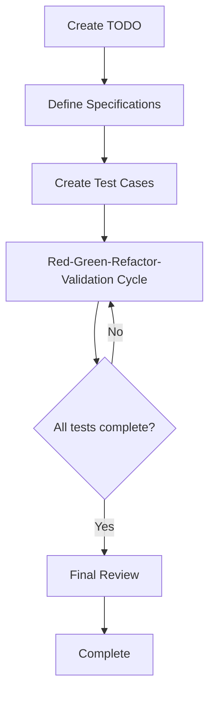

# 3.1 Overall Flow of the Extended TDD Process

## Overview of the AITDD Process

AITDD is an extended development methodology that combines the power of AI with traditional TDD (Test-Driven Development) and adds a **Validation** step. By having humans and AI collaborate, high-quality software can be developed efficiently.

## Structure of the Overall Flow



### Basic Process Flow

```
Create TODO → Define Specifications → Create Test Cases → Red-Green-Refactor-Validation → Final Review
```

## Details of Each Step

### 1. Create TODO (Handled by Humans)

**Objective**: To clearly define development tasks and break them down into appropriate work units.

**Tasks**:
- Identify functional requirements
- Break down development tasks
- Set priorities
- Clarify the scope of work

**Deliverable**: `TODO.md` file
- A task list of concrete, implementable units
- Priority and dependencies for each task
- Definition of completion criteria

### 2. Define Specifications (Handled by Humans, Review Required)

**Objective**: To formulate detailed technical specifications from the TODOs.

**Tasks**:
- Define detailed specifications for features
- Clarify inputs and outputs
- Formulate an error handling policy
- Set performance requirements

**Key Points**:
- **Review by humans is mandatory**
- While referencing AI suggestions, the final decisions are made by humans
- Eliminate ambiguity in specifications

**Deliverable**: `requirements.md` file
- Details of functional requirements
- Technical constraints
- Quality requirements

### 3. Create Test Cases (Handled by Humans, Review Required)

**Objective**: To design comprehensive test cases based on the specifications.

**Tasks**:
- Design happy path test cases
- Design sad path test cases
- Plan boundary value tests
- Identify edge cases

**Key Points**:
- **Review by humans is mandatory**
- Ensure the comprehensiveness of test cases
- Verify consistency with specifications

**Deliverable**: `testcases.md` file
- A list of test cases
- Details of expected behavior
- Definition of test data

### 4. Red-Green-Refactor-Validation Cycle (Mainly Handled by AI)

This extends the traditional TDD cycle by adding a **Validation** step. This cycle is almost entirely executed by the AI, but it is done under human supervision.

#### Red (Test Fails)
- Implement the test case
- Confirm the expected failure
- Run the test and confirm failure

#### Green (Minimal Implementation)
- Minimal implementation to make the test pass
- Automatic code generation by AI
- Confirm test success

#### Refactor (Refactoring)
- Improve code quality
- Optimization by AI
- Improve readability and maintainability

#### Validation (Verification)
- Verify the validity of the implementation
- Quality check
- Check additional verification items

### 5. Final Review (Handled by Humans)

**Objective**: To make a final confirmation of the quality and specification compliance of the entire generated code.

**Tasks**:
- Detailed review of the source code
- Check for consistency with specifications
- Security check
- Performance verification

**Key Points**:
- **Must be performed by a human**
- Final quality assurance for AI-generated code
- The last line of defense before deploying to production

## Role Division Between AI and Humans

### Areas Handled by AI (e.g., Claude)

- **Execution of the Red-Green-Refactor-Validation cycle**
  - Implementation of test cases
  - Generation of production code
  - Execution of refactoring
  - Support for quality verification

- **Code Generation and Optimization**
  - Implementation of efficient algorithms
  - Implementation according to coding standards
  - Automatic code improvement

- **Automated Test Execution**
  - Running tests and checking results
  - Measuring test coverage
  - Continuous quality checks

### Areas Handled by Humans

- **Strategic Judgment**
  - Defining and reviewing specifications
  - Designing and reviewing test cases
  - Making architectural decisions

- **Quality Control**
  - Final source code review
  - Confirming security requirements
  - Checking for compliance with business requirements

- **Creative Work**
  - Deciding on problem-solving approaches
  - Designing the user experience
  - Making technology choices

## Comparison with Traditional TDD

| Item | Traditional TDD | AITDD |
|---|---|---|
| **Cycle** | Red-Green-Refactor | Red-Green-Refactor-**Validation** |
| **Implementer** | Human | **AI** (under human supervision) |
| **Review** | Only after implementation | **Specs, tests, and final code** |
| **Speed** | Depends on human implementation speed | **Significantly faster with AI support** |
| **Quality Control** | Depends on developer skills | **Multi-layered quality checks** |
| **Learning Cost** | Requires learning TDD | **TDD + AI utilization skills** |

## Advantages of the Process

### 1. Improved Development Speed
- Significantly reduced implementation time due to automatic code generation by AI
- Automation of repetitive tasks
- Faster test execution and feedback

### 2. Improved Quality
- Additional quality checks through the Validation step
- A dual-check system with humans and AI
- Application of consistent quality standards

### 3. Utilization of Knowledge
- Use of the latest technologies and best practices by AI
- High-quality code generation even by less experienced developers
- Automatic utilization of domain knowledge

### 4. Continuous Improvement
- Learning effect from AI feedback
- Continuous optimization of the process itself
- Improvement of the entire team's skills

## Points to Note and Risk Management

### 1. Avoiding Over-reliance on AI
- Important decisions are always made by humans
- Do not blindly accept AI suggestions
- Continuously deepen technical understanding

### 2. Strengthening Quality Control
- Conduct reviews at multiple stages
- Use a combination of automated and manual tests
- Ensure security requirements are met

### 3. Flexibility of the Process
- Adjust the process according to the project
- Apply according to the team's skill level
- Continuously improve the process

## Next Steps

In Chapter 3, we will explain each step of this process in detail:

- [3.2 TODO Creation and Specification Definition](./02-todo-and-specification_english.md)
- [3.3 Test Case Creation](./03-test-case-creation_english.md)
- [3.4 The Red-Green-Refactor-Validation Cycle](./04-rgr-validation-cycle_english.md)
- [3.5 Details of the Validation Step](./05-validation-details_english.md)

Let's learn the specific procedures and techniques for each step to be able to practice AITDD in reality.
