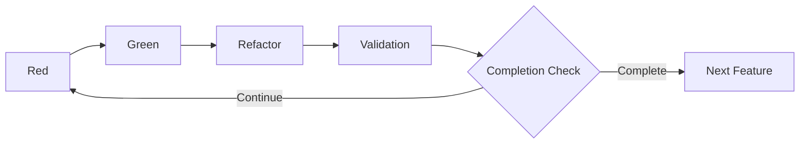

# 3.4 The Red-Green-Refactor-Validation Cycle

## Overview of the Extended TDD Cycle

The core of AITDD is an extended cycle that adds a **Validation** step to the traditional TDD (Red-Green-Refactor) cycle. This cycle is primarily executed by the AI, but it is done under human supervision to efficiently generate high-quality code.



## Details of the Red-Green-Refactor-Validation Cycle

### Red Phase: Confirming Test Failure

#### Objective
- To implement the test cases
- To confirm that the tests fail as expected
- To verify the correctness of the tests themselves

#### Specific Tasks

##### 1. Implementing Test Cases
```javascript
// Example: Test implementation for user registration feature
describe('User Registration', () => {
  test('should create user with valid data', async () => {
    const userData = {
      email: 'test@example.com',
      password: 'SecurePass123!',
      password_confirmation: 'SecurePass123!'
    };

    const response = await request(app)
      .post('/api/users')
      .send(userData);

    expect(response.status).toBe(201);
    expect(response.body).toHaveProperty('id');
    expect(response.body.email).toBe(userData.email);

    // Database check
    const user = await User.findByEmail(userData.email);
    expect(user).toBeTruthy();
    expect(user.password_hash).not.toBe(userData.password);
  });

  test('should reject duplicate email', async () => {
    // Pre-create an existing user
    await createUser({ email: 'existing@example.com' });

    const duplicateData = {
      email: 'existing@example.com',
      password: 'NewPass456!'
    };

    const response = await request(app)
      .post('/api/users')
      .send(duplicateData);

    expect(response.status).toBe(400);
    expect(response.body.error).toBe('validation_failed');
    expect(response.body.details[0].field).toBe('email');
  });
});
```

##### 2. Running Tests and Confirming Failure
```bash
$ npm test
❌ User Registration › should create user with valid data
   Error: Cannot POST /api/users

❌ User Registration › should reject duplicate email
   Error: Cannot POST /api/users
```

##### 3. Confirming the Reason for Failure
- Endpoint is not implemented
- Missing necessary dependencies
- Incorrect test environment setup

#### Executing the Red Phase with AI

##### Example Prompt
```markdown
## Instruction: Execute Red Phase

### Background
- Feature: User Registration API
- Test Case Specification: See testcases.md
- Existing Code: Check under src/

### Tasks
1. Implement each test case from testcases.md as a Jest test.
2. Run the tests and confirm that they fail as expected.
3. Organize and report the reasons for failure.

### Output Format
- Complete test code
- Test execution results
- Analysis of failure reasons
- Proposal for the next Green phase
```

### Green Phase: Minimal Implementation

#### Objective
- To perform the minimal implementation to make the tests pass
- To avoid excessive implementation and maintain a test-driven approach
- To leave room for improvement in the next Refactor phase

#### Specific Tasks

##### 1. Minimal API Implementation
```javascript
// routes/users.js
const express = require('express');
const bcrypt = require('bcrypt');
const User = require('../models/User');
const router = express.Router();

router.post('/users', async (req, res) => {
  try {
    const { email, password, password_confirmation } = req.body;

    // Basic validation
    if (!email || !password || !password_confirmation) {
      return res.status(400).json({
        error: 'validation_failed',
        details: [{ field: 'required', message: 'Missing required fields' }]
      });
    }

    if (password !== password_confirmation) {
      return res.status(400).json({
        error: 'validation_failed',
        details: [{ field: 'password', message: 'Password confirmation does not match' }]
      });
    }

    // Duplicate check
    const existingUser = await User.findByEmail(email);
    if (existingUser) {
      return res.status(400).json({
        error: 'validation_failed',
        details: [{ field: 'email', message: 'Email already exists' }]
      });
    }

    // Password hashing
    const password_hash = await bcrypt.hash(password, 10);

    // Create user
    const user = await User.create({
      email,
      password_hash
    });

    res.status(201).json({
      id: user.id,
      email: user.email,
      created_at: user.created_at
    });

  } catch (error) {
    console.error('User creation error:', error);
    res.status(500).json({ error: 'Internal server error' });
  }
});

module.exports = router;
```

##### 2. Minimal Necessary Model Implementation
```javascript
// models/User.js
const db = require('../database');

class User {
  static async findByEmail(email) {
    const result = await db.query(
      'SELECT * FROM users WHERE email = ?',
      [email]
    );
    return result[0] || null;
  }

  static async create({ email, password_hash }) {
    const result = await db.query(
      'INSERT INTO users (email, password_hash, created_at) VALUES (?, ?, NOW())',
      [email, password_hash]
    );

    return {
      id: result.insertId,
      email,
      created_at: new Date()
    };
  }
}

module.exports = User;
```

##### 3. Running Tests and Confirming Success
```bash
$ npm test
✅ User Registration › should create user with valid data
✅ User Registration › should reject duplicate email

Tests: 2 passed, 2 total
```

#### Executing the Green Phase with AI

##### Example Prompt
```markdown
## Instruction: Execute Green Phase

### Background
- Failing Tests: [Result of the Red phase]
- Requirements: See requirements.md
- Existing Code Structure: Check under src/

### Tasks
1. Minimal implementation to pass the failing tests.
2. Avoid excessive implementation of requirements.
3. Confirm that all cases succeed by running the tests.

### Constraints
- Adhere to the minimal implementation principle.
- Do not implement features other than those in the test cases.
- Maintain consistency with existing code.

### Output Format
- Complete implementation code
- Test execution results
- Explanation of the implementation policy
```

### Refactor Phase: Code Improvement

#### Objective
- To improve the quality of the code
- To improve maintainability and readability
- To optimize performance
- To ensure tests continue to succeed

#### Specific Tasks

##### 1. Improving Code Structure
```javascript
// services/UserService.js - Separation of business logic
class UserService {
  constructor(userRepository, passwordHasher) {
    this.userRepository = userRepository;
    this.passwordHasher = passwordHasher;
  }

  async createUser({ email, password, password_confirmation }) {
    // Validation
    this.validateUserInput({ email, password, password_confirmation });

    // Duplicate check
    await this.checkEmailUniqueness(email);

    // Create user
    const password_hash = await this.passwordHasher.hash(password);
    return await this.userRepository.create({ email, password_hash });
  }

  validateUserInput({ email, password, password_confirmation }) {
    const errors = [];

    if (!this.isValidEmail(email)) {
      errors.push({ field: 'email', message: 'Invalid email format' });
    }

    if (!this.isValidPassword(password)) {
      errors.push({ field: 'password', message: 'Password does not meet requirements' });
    }

    if (password !== password_confirmation) {
      errors.push({ field: 'password_confirmation', message: 'Password confirmation does not match' });
    }

    if (errors.length > 0) {
      throw new ValidationError(errors);
    }
  }

  async checkEmailUniqueness(email) {
    const existingUser = await this.userRepository.findByEmail(email);
    if (existingUser) {
      throw new ValidationError([{ field: 'email', message: 'Email already exists' }]);
    }
  }

  isValidEmail(email) {
    const emailRegex = /^[^\s@]+@[^\s@]+\.[^\s@]+$/;
    return email && email.length <= 254 && emailRegex.test(email);
  }

  isValidPassword(password) {
    if (!password || password.length < 8) return false;

    const hasUpperCase = /[A-Z]/.test(password);
    const hasLowerCase = /[a-z]/.test(password);
    const hasNumbers = /\d/.test(password);
    const hasSymbols = /[!@#$%^&*()_+\-=\[\]{};':"\\|,.<>\/?]/.test(password);

    return hasUpperCase && hasLowerCase && hasNumbers && hasSymbols;
  }
}

// Simplifying the controller
router.post('/users', async (req, res) => {
  try {
    const user = await userService.createUser(req.body);
    res.status(201).json({
      id: user.id,
      email: user.email,
      created_at: user.created_at
    });
  } catch (error) {
    if (error instanceof ValidationError) {
      return res.status(400).json({
        error: 'validation_failed',
        details: error.details
      });
    }

    console.error('User creation error:', error);
    res.status(500).json({ error: 'Internal server error' });
  }
});
```

##### 2. Improving Error Handling
```javascript
// errors/ValidationError.js
class ValidationError extends Error {
  constructor(details) {
    super('Validation failed');
    this.name = 'ValidationError';
    this.details = details;
  }
}

// middlewares/errorHandler.js
const errorHandler = (error, req, res, next) => {
  if (error instanceof ValidationError) {
    return res.status(400).json({
      error: 'validation_failed',
      details: error.details
    });
  }

  console.error('Unhandled error:', error);
  res.status(500).json({ error: 'Internal server error' });
};
```

##### 3. Confirming Quality Maintenance by Running Tests
```bash
$ npm test
✅ User Registration › should create user with valid data
✅ User Registration › should reject duplicate email
✅ User Registration › should validate email format
✅ User Registration › should validate password strength

Tests: 4 passed, 4 total
```

#### Executing the Refactor Phase with AI

##### Example Prompt
```markdown
## Instruction: Execute Refactor Phase

### Background
- Current Code: [Deliverable from the Green phase]
- Test Status: All tests successful
- Quality Goals: Improve maintainability, readability, and performance

### Tasks
1. Improve code structure (separation of responsibilities, DRY principle).
2. Unify error handling.
3. Optimize performance.
4. Apply coding standards.
5. Confirm quality maintenance by running tests.

### Constraints
- Do not break existing tests.
- Avoid excessive architectural changes.
- Emphasize gradual improvement.

### Output Format
- Refactored code
- Explanation of improvements
- Test execution results
```

### Validation Phase: Comprehensive Verification

#### Objective
- To comprehensively verify the validity of the implementation
- To confirm compliance with quality standards
- To evaluate the need for additional test cases
- To make a completion decision

#### Specific Verification Items

##### 1. Confirming Implemented Test Cases
```markdown
## Test Case Implementation Status Check

### Planned Test Cases (from testcases.md)
- [x] TC001: Normal user registration
- [x] TC002: Duplicate email address error
- [x] TC003: Password mismatch error
- [x] TC004: Invalid email address format
- [x] TC005: Insufficient password strength
- [x] TC006: Required fields not entered
- [x] TC007: Boundary value test - email length
- [ ] TC008: Rate limit test (not implemented)
- [ ] TC009: Database connection error (not implemented)
- [x] TC010: CSRF token validation

### Implementation Rate: 80% (8/10)
```

##### 2. Confirming Regression of Existing Tests
```bash
$ npm test
✅ User Authentication › should login with valid credentials
✅ User Authentication › should reject invalid password
✅ User Registration › should create user with valid data
✅ User Registration › should reject duplicate email
✅ Product Management › should create product
✅ Product Management › should list products

Tests: 6 passed, 6 total
Time: 2.341s
```

##### 3. Confirming Code Quality Metrics
```bash
$ npm run quality-check
✅ ESLint: 0 errors, 0 warnings
✅ Test Coverage: 95% statements, 92% branches
✅ Code Complexity: Average 3.2 (Good)
✅ Dependency Check: No vulnerabilities found
```

##### 4. Confirming Specification Compliance
```markdown
## Specification Compliance Check

### Functional Requirements
- [x] New user registration with email/password
- [x] Validation for duplicate emails
- [x] Password strength check
- [x] Password hashing (bcrypt)

### Non-functional Requirements
- [x] Response time: Average 1.2s (within 2s)
- [ ] Concurrent registrations: Load test not performed
- [x] Password hashing is mandatory

### API Specification
- [x] POST /api/users endpoint
- [x] Expected request/response format
- [x] Appropriate HTTP status codes

### Database Design
- [x] users table design
- [x] Appropriate indexes
- [x] Implementation of constraints
```

##### 5. Confirming Security Requirements
```markdown
## Security Check

### Password Management
- [x] No plaintext password storage
- [x] Hashing with bcrypt
- [x] Use of appropriate salt

### Input Validation
- [x] SQL injection countermeasures
- [x] XSS countermeasures
- [x] CSRF token validation

### Access Control
- [x] Appropriate HTTP status codes
- [x] Appropriate restriction of error information
```

#### Executing the Validation Phase with AI

##### Example Prompt
```markdown
## Instruction: Execute Validation Phase

### Background
- Completed Implementation Code: [Deliverable from the Refactor phase]
- Requirements Definition: requirements.md
- Test Cases: testcases.md
- Existing System: Entire codebase

### Verification Items
1. Check the implementation status of all test cases listed in testcases.md.
2. Run regression tests for existing tests.
3. Confirm fulfillment of requirements in requirements.md.
4. Measure code quality metrics.
5. Confirm security requirements.

### Completion Criteria
- 90% or more of planned test cases implemented
- All existing tests successful
- 100% fulfillment of important requirements
- No critical security issues

### Output Format
- Verification result report
- List of unimplemented test cases
- Quality metrics
- Completion/Continuation decision with reasons
```

#### Decision Criteria for the Validation Phase

##### ✅ Completion Decision (Automatically proceed to the next step)
```markdown
### Completion Conditions
- Existing Test Status: All successful
- Test Case Implementation Rate: 90% or more
- Important Requirement Fulfillment Rate: 100%
- Code Coverage: 80% or more
- Security Check: No critical issues
```

##### ⚠️ Continuation Decision (Additional implementation required)
```markdown
### Continuation Conditions
- Existing Tests: Failures present
- Test Case Implementation Rate: Less than 90%
- Important Requirements: Unfulfilled items exist
- Quality Metrics: Below standard values
- Security: Critical issues found
```

## Managing the Entire Cycle

### Process Control

#### 1. Automating Cycle Execution
```markdown
## Example of an AITDD Execution Script

### Input
- requirements.md
- testcases.md
- Existing codebase

### Execution Flow
1. Red: Implement and run test cases
2. Green: Minimal implementation
3. Refactor: Code improvement
4. Validation: Comprehensive verification
5. Decision: Automatic decision of completion/continuation

### Output
- Implementation code
- Test results
- Quality report
- Recommendations for the next step
```

#### 2. Visualizing Progress
```markdown
## Progress Tracking

### Test Case Progress
- Implemented: 8/10 (80%)
- Successful: 8/8 (100%)
- Failed: 0/8 (0%)

### Quality Metrics
- Coverage: 95%
- Complexity: 3.2 (Good)
- Duplication: 2% (Good)

### Requirement Fulfillment
- Functional Requirements: 100%
- Non-functional Requirements: 80%
- Security Requirements: 100%
```

### Human Intervention Points

#### 1. When Important Decisions are Needed
- Major architectural changes
- Interpretation of security requirements
- Adjustment of performance requirements
- Complex decisions on business logic

#### 2. Adjusting Quality Standards
- Target values for test coverage
- Allowable values for code complexity
- Review of performance requirements

#### 3. Optimizing the Process
- Improving cycle execution time
- Improving the accuracy of AI instructions
- Expanding the scope of automation

## Error Handling and Debugging

### Common Problems and Their Solutions

#### 1. Tests do not fail correctly in the Red phase
**Cause**: Mistakes in test case implementation, environment setup problems
**Solution**: Reconfirm the test case specification, initialize the environment

#### 2. Excessive implementation in the Green phase
**Cause**: Lack of understanding of the minimal implementation principle
**Solution**: Thoroughly apply test-driven approach, clarify the scope of implementation

#### 3. Tests break in the Refactor phase
**Cause**: Logical changes during refactoring
**Solution**: Gradual refactoring, continuous test execution

#### 4. Standards not met in the Validation phase
**Cause**: Lack of understanding of requirements, mistakes in setting quality standards
**Solution**: Reconfirm requirements, adjust standard values

## Next Steps

Once you understand the Red-Green-Refactor-Validation cycle, the next step is to learn more advanced quality control methods in [Details of the Validation Step](./05-validation-details.md).

### Learning Points
- [ ] Understood the objective and tasks of each phase
- [ ] Grasped the role division between AI and humans
- [ ] Mastered the quality control method for the entire cycle
- [ ] Learned the basic patterns for error handling

By mastering this cycle, you will be able to efficiently develop high-quality software while making the most of AI's power.
