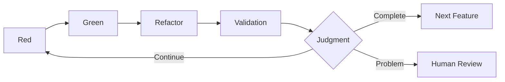

# 3.5 Details of the Validation Step

## The Position of the Validation Step

The Validation step is one of the most important innovations in AITDD. This step, added to the traditional TDD's Red-Green-Refactor cycle, automates the quality assurance and completion judgment of AI-generated code, realizing a more reliable development process.

## The Purpose of the Validation Step

### 1. Multi-layered Quality Assurance
- **Fulfillment of Functional Requirements**: The planned features are implemented correctly.
- **Regression Prevention**: No adverse effects on existing features.
- **Code Quality**: Maintainable, high-quality code is generated.

### 2. Automation of Completion Judgment
- Completion judgment based on objective criteria.
- Pre-filtering before human review.
- Continuous quality monitoring.

### 3. Feedback for Process Improvement
- Grasping the quality trends of AI-generated code.
- Gathering information for prompt improvement.
- Measuring and optimizing development efficiency.

## Execution Timing of the Validation Step



## Specific Work Procedures

### 1. Confirming the Green State of Existing Tests

#### Mandatory Condition
It is a prerequisite that all existing tests are successful.

```bash
# Run tests
$ npm test

# Expected result
✅ User Authentication › should login with valid credentials
✅ User Authentication › should reject invalid password
✅ User Registration › should create user with valid data
✅ User Registration › should reject duplicate email
✅ Product Management › should create product
✅ Product Management › should list products

Tests: 6 passed, 6 total
Time: 2.341s
Coverage: 94%
```

#### Response to Failures
```markdown
❌ Response when there are test failures

1. Identify the cause of failure
   - Impact on existing features due to new implementation
   - Conflict in test data
   - Environment-dependent issues

2. Implement corrections
   - Fix the problematic code
   - Adjust the test data
   - Review the environment settings

3. Confirm by rerunning
   - Rerun all tests
   - Continue Validation after confirming success
```

### 2. Confirming the TDD Memo File and Requirements Definition Document

#### Files to be Confirmed
```markdown
## Document Confirmation List

### Mandatory Files
- doc/implementation/{feature_name}-requirements.md
- doc/implementation/{feature_name}-testcases.md
- doc/todo.md

### Optional Files (if they exist)
- doc/implementation/{test_case_name}-memo.md
- doc/implementation/{feature_name}-architecture.md
```

#### Example of Confirmation Content
```markdown
# User Registration Feature Requirements Confirmation

## Extracted from requirements.md
### Planned Features
- [x] New user registration with email/password
- [x] Validation for duplicate emails
- [x] Password strength check
- [x] Password hashing (bcrypt)
- [ ] Rate limiting (100/sec) ← Not implemented

### Extracted from testcases.md
### Number of planned test cases: 10
- TC001: Normal user registration
- TC002: Duplicate email address error
- TC003: Password mismatch error
- TC004: Invalid email address format
- TC005: Insufficient password strength
- TC006: Required fields not entered
- TC007: Boundary value test - email length
- TC008: Rate limit test
- TC009: Database connection error
- TC010: CSRF token validation
```

### 3. Confirming Implemented Test Cases

#### Analysis of Test Files
```javascript
// Example analysis of __tests__/user-registration.test.js

describe('User Registration', () => {
  // Confirm implemented test cases
  test('TC001: should create user with valid data', async () => {
    // Implemented ✅
  });

  test('TC002: should reject duplicate email', async () => {
    // Implemented ✅
  });

  test('TC003: should reject password mismatch', async () => {
    // Implemented ✅
  });

  test('TC004: should validate email format', async () => {
    // Implemented ✅
  });

  test('TC005: should validate password strength', async () => {
    // Implemented ✅
  });

  test('TC006: should require all fields', async () => {
    // Implemented ✅
  });

  test('TC007: should handle email length limits', async () => {
    // Implemented ✅
  });

  test('TC010: should verify CSRF token', async () => {
    // Implemented ✅
  });

  // TC008, TC009 are not implemented
});
```

#### Aggregation of Implementation Status
```markdown
## Test Case Implementation Status

### Implemented: 8
- TC001: Normal user registration ✅
- TC002: Duplicate email address error ✅
- TC003: Password mismatch error ✅
- TC004: Invalid email address format ✅
- TC005: Insufficient password strength ✅
- TC006: Required fields not entered ✅
- TC007: Boundary value test ✅
- TC010: CSRF token validation ✅

### Not Implemented: 2
- TC008: Rate limit test ❌
- TC009: Database connection error ❌

### Implementation Rate: 80% (8/10)
```

### 4. Analysis of Implementation Status and Judgment for Updating TODO.md

#### Quality Risk Assessment by AI

```markdown
## Example AI Analysis Report

### Implementation Completion Assessment
- Basic feature implementation rate: 100%
- Test case implementation rate: 80%
- Requirement fulfillment rate: 90%

### Importance Analysis of Unimplemented Items
#### TC008: Rate limit test
- Importance: Medium (security-related)
- Scope of impact: Risk of abuse in the production environment
- Implementation priority: Medium

#### TC009: Database connection error
- Importance: High (availability-related)
- Scope of impact: Stability of the entire system
- Implementation priority: High

### Quality Risk Assessment
- Security risk: Medium (rate limiting not implemented)
- Availability risk: High (behavior during DB failure is unknown)
- Maintainability risk: Low (good code quality)

### Recommended Actions
1. Prioritize implementation of TC009 (DB connection error).
2. Consider implementing TC008 (rate limiting) in the next phase.
3. It is possible to proceed to the next step at this point, but caution is advised.
```

## Judgment Criteria for Validation

### ✅ Fully Implemented (Automatically proceeds to the next step)

```markdown
### Completion Conditions
- Existing test status: All green ✅
- Test case implementation rate: 100% ✅
- Important feature completion rate: 100% ✅
- Quality risk: None ✅
- Security check: Pass ✅

### Automatic Judgment Result
🎉 Implementation complete - Automatically proceeding to the next requirements definition step.
```

### ⚠️ Implementation Incomplete (Additional implementation required)

```markdown
### Continuation Conditions (Example 1: Critical unimplemented items)
- Existing test status: All green ✅
- Test case implementation rate: 70% ❌
- Important feature completion rate: 80% ❌
- Quality risk: High-risk items present ❌

### Judgment Result
⚠️ Additional implementation required - Returning to the Red step to add unimplemented items.

### Continuation Conditions (Example 2: Existing tests fail)
- Existing test status: Failures present ❌
- Test case implementation rate: 90% ✅
- Important feature completion rate: 95% ✅

### Judgment Result
❌ Regression test failed - Returning to the Green/Refactor step for correction.
```

### 🔍 Judgment Required (Human review necessary)

```markdown
### Cases where judgment is difficult
- Test case implementation rate: 85% (borderline)
- Unimplemented items: Importance is difficult to judge
- Quality risk: Requires organization-specific judgment
- Business requirements: Ambiguity in the interpretation of specifications

### Judgment Result
🔍 Human review requested - Judgment based on expert knowledge is required.
```

## The Judgment Process by AI

### 1. Information Gathering and Analysis

#### Input Information
```markdown
## Input Data for Validation Execution

### Technical Information
- Test execution results (details of success/failure)
- Code coverage report
- Static analysis results (ESLint, TypeScript, etc.)
- Performance test results

### Specification Information
- requirements.md (functional/non-functional requirements)
- testcases.md (list of test cases)
- architecture.md (architecture design)

### Project Information
- Existing codebase
- Dependency information
- Environment settings
```

#### Analysis Method
```markdown
## AI Analysis Approach

### 1. Quantitative Analysis
- Calculation of test case implementation rate
- Evaluation of code coverage
- Measurement of complexity metrics
- Confirmation of performance indicators

### 2. Qualitative Analysis
- Confirmation of consistency between requirements and implementation
- Subjective evaluation of code quality
- Checking security requirements
- Evaluation of maintainability

### 3. Risk Assessment
- Impact analysis of unimplemented features
- Evaluation of security risks
- Evaluation of operational risks
- Evaluation of technical debt
```

### 2. Judgment Logic

#### Hierarchical Judgment System
```markdown
## Judgment Priority

### Level 1: Critical Issues (Immediate continuation judgment)
1. Failure of existing tests
2. Critical security issues
3. Risk of data corruption

### Level 2: Lack of Important Features (Continuation recommended)
1. Unimplemented basic features
2. Lack of important error handling
3. Lack of mandatory validation

### Level 3: Quality Standards (Judgment by threshold)
1. Test coverage < 80%
2. Test case implementation rate < 90%
3. Complexity > allowable value

### Level 4: Overall Judgment (Complete/Continue/Judgment Required)
- Final judgment based on all of the above
- Comparison with organizational quality standards
- Consideration of the project status
```

#### Example of a Validation Judgment Prompt
```markdown
## Validation Judgment Prompt

You are a quality judgment AI for the AITDD Validation step. Please make an implementation completion judgment based on the following information.

### Judgment Target
- Feature: User Registration API
- Implementation Result: [Code, test results, quality metrics]
- Requirements: [Content of requirements.md]
- Test Cases: [Content of testcases.md]

### Judgment Criteria
1. Existing Tests: All must succeed
2. Test Case Implementation Rate: 90% or more for completion
3. Important Features: 100% implementation required
4. Security: No critical issues required

### Output Format
```json
{
  "judgment_result": "Complete|Continue|Judgment Required",
  "implementation_rate": {
    "test_cases": "80%",
    "important_features": "100%"
  },
  "quality_evaluation": {
    "security": "Pass|Caution|Fail",
    "performance": "Good|Average|Needs Improvement",
    "maintainability": "High|Medium|Low"
  },
  "unimplemented_items": [
    {
      "item": "TC008",
      "importance": "Medium|High|Low",
      "recommended_action": "Implement immediately|Implement next phase|Implementation not required"
    }
  ],
  "reason_for_continuation": "Reason if the judgment is to continue",
  "next_action": "Specific next step"
}
```
```

## Visualization of Guesses with a Traffic Light System

### Utilizing the Traffic Light System

The Validation step visualizes the AI's guesses to improve the efficiency of human reviews.

#### 🟢 Green Light (High Confidence)
```markdown
## Content that can be clearly inferred from the source files

### Example: Test Case Implementation Status
- 🟢 TC001 implemented (corresponding test exists in the test file)
- 🟢 Basic feature operation confirmed (test success result exists)
- 🟢 Error handling implemented (clearly stated in the requirements document)
```

#### 🟡 Yellow Light (Caution/Confirmation Required)
```markdown
## Content supplemented by guessing but seems reasonable

### Example: Quality Judgment
- 🟡 80% code coverage is sufficient (judgment based on general standards)
- 🟡 Performance requirements not measured, but likely not an issue (inferred from implementation content)
- 🟡 Medium security risk (estimated due to unimplemented rate limiting)
```

#### 🔴 Red Light (Verification Required)
```markdown
## Content not in the source files and based on independent judgment

### Example: Business Judgment
- 🔴 Implementation priority of rate limiting is "Medium" (organizational policy unknown)
- 🔴 DB connection error handling is mandatory (operational requirements unconfirmed)
- 🔴 Sufficient to implement in the next phase (project schedule unknown)
```

### Management with TODO Format

```markdown
## Validation Result TODO

### 🟢 High Confidence Items (Confirmation recommended)
- [ ] Confirm that TC001-007 of [testcases.md](./testcases.md) are implemented.
- [ ] Confirm that 100% of the basic features in the [Requirements Document](./requirements.md) are implemented.

### 🟡 Medium Confidence Items (Confirmation required)
- [ ] Confirm the performance characteristics of the [implementation code](./src/users.js).
- [ ] Confirm compliance with the [security requirements](./requirements.md).

### 🔴 Judgment Required Items (Important)
- [ ] Detailed confirmation: Judge the implementation priority of [unimplemented items](./testcases.md) based on organizational standards.
- [ ] Detailed confirmation: Confirm the requirements for DB failure in the [operational requirements](./requirements.md).
- [ ] Detailed confirmation: Adjust the implementation plan based on the project schedule.
```

## Optimizing the Validation Step

### 1. Improving Accuracy by Improving Prompts

#### Points for Improvement
```markdown
## Points for Improving Prompt Quality

### 1. Clarifying Judgment Criteria
- Making numerical criteria specific (e.g., coverage 80% or more)
- Detailing priority judgment rules
- Reflecting organization-specific standards

### 2. Enriching Contextual Information
- Providing project background
- Relationship with existing systems
- Constraints of the operational environment

### 3. Standardizing the Output Format
- Structured output in JSON format
- Utilization of the traffic light system
- Organizing issues in TODO format
```

#### Evolution of Prompt Templates
```markdown
## Phased Prompt Improvement

### v1.0: Basic Version
- Basic judgment function
- Simple complete/continue judgment

### v2.0: Detailed Version
- Added quality metrics evaluation
- Strengthened risk assessment function
- Introduced the traffic light system

### v3.0: Organization-Optimized Version
- Incorporation of organization-specific standards
- Consideration of project characteristics
- Improvement based on learning data
```

### 2. Expanding the Scope of Automation

#### Current Level of Automation
```markdown
## Current State of Automation

### Fully Automated
- Test execution and result collection
- Measurement of basic quality metrics
- Standard judgments (where there are clear criteria)

### Semi-automated (Human confirmation required)
- Judgment of importance (from a business perspective)
- Security risk assessment
- Evaluation of architectural impact

### Manual Response Required
- Confirmation of consistency with organizational policy
- Consideration of project-specific circumstances
- Stakeholder coordination
```

#### Direction for Expanding Automation
```markdown
## Future Automation Plan

### Short-term (1-3 months)
- Function to customize quality standards
- Learning function based on past results
- Automatic report generation function

### Mid-term (3-6 months)
- Learning of organization-specific rules
- Automatic consideration of project characteristics
- Automation of stakeholder notifications

### Long-term (6+ months)
- Predictive quality management
- Automatic process optimization
- Incorporation of team learning
```

## Common Problems and Solutions

### Problem 1: Ambiguous judgment criteria

**Symptom**:
- The complete/continue judgment is inconsistent
- Discrepancy between human and AI judgments

**Cause**:
- Undefined organization-specific quality standards
- Ambiguity in judgment rules

**Solution**:
```markdown
### Clarifying Judgment Criteria
1. Setting numerical standards
   - Test coverage: 80% or more
   - Test case implementation rate: 90% or more
   - Important feature completion rate: 100%

2. Documenting quality standards
   - Security requirements checklist
   - Performance tolerance values
   - Code quality standards

3. Defining exception handling rules
   - Consideration of project-specific circumstances
   - Relaxation of standards for emergency releases
   - Allowable level of technical debt
```

### Problem 2: Human review bottleneck

**Symptom**:
- "Judgment required" occurs frequently in Validation
- Increased waiting time for human review

**Cause**:
- Insufficient accuracy of AI judgment
- Insufficient learning of organizational rules

**Solution**:
```markdown
### Improving AI Judgment Accuracy
1. Accumulating learning data
   - Feedback on past judgment results
   - Learning from success/failure patterns
   - Reflection of organization-specific rules

2. Improving prompts
   - More specific judgment criteria
   - Enriching contextual information
   - Phased judgment system

3. Adjusting thresholds
   - Stricter criteria for automatic completion
   - Clearer criteria for "judgment required"
   - Improved accuracy of continuation judgment
```

### Problem 3: Excessive quality requirements

**Symptom**:
- Many items do not pass the completion judgment
- Decreased development efficiency

**Cause**:
- Quality standards are too strict
- A perfectionist setup

**Solution**:
```markdown
### Balanced Quality Management
1. Phased quality standards
   - MVP (Minimum Viable Product) standards
   - Production standards
   - Enterprise standards

2. Risk-based judgment
   - Adjusting standards according to the degree of impact
   - Prioritizing implementation of important features
   - Allowing non-important features to be postponed

3. Continuous improvement
   - Regular review of standards
   - Reflection of team feedback
   - Optimization based on results
```

## Summary and Next Steps

The Validation step is the cornerstone of quality assurance in the AITDD process, and when operated properly, it provides:

### Effects to be Gained
- **Stabilization of Quality**: Application of consistent quality standards
- **Improvement in Efficiency**: Optimization of human reviews
- **Continuous Improvement**: A feedback loop for process improvement

### Key Points for Success
- **Clear Standard Setting**: Quantified judgment criteria
- **Phased Introduction**: Phased application tailored to the organization
- **Continuous Optimization**: Process improvement based on results

### Next Learning
After understanding the overall picture of the AITDD process in Chapter 3, let's actually experience AITDD in [Chapter 4: Practical Hands-On](../04-hands-on/01-first-project.md).

Through actual development, you can experience how this Validation step functions and contributes to quality improvement.
