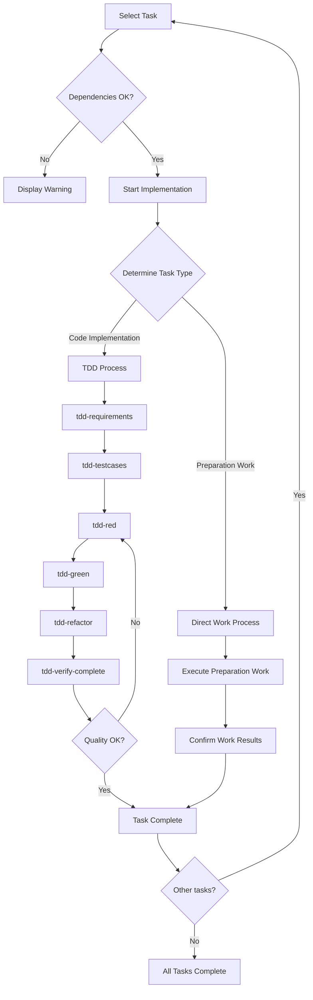

# kairo-implement

## Objective

To implement divided tasks sequentially, or tasks specified by the user. To perform high-quality implementation by utilizing existing TDD commands.

## Prerequisites

- A task list exists in `docs/tasks/{requirement_name}-tasks.md`.
- The user has approved the implementation of the tasks.
- Existing TDD commands are available.
- The workspace for implementation is set up.

## Execution Content

**[Reliability Level Instruction]**:
For each item, please comment on the verification status with the original materials (including EARS requirements definition documents and design documents) using the following signals:

- 🟢 **Green Light**: When there is almost no guesswork and it is based on the EARS requirements definition document/design document.
- 🟡 **Yellow Light**: When it is a reasonable guess from the EARS requirements definition document/design document.
- 🔴 **Red Light**: When it is a guess not found in the EARS requirements definition document/design document.

1.  **Select Task**
    -   Search for the specified task ID with @agent-symbol-searcher, and read the found task file with the Read tool.
    -   Confirm the task ID specified by the user.
    -   If not specified, automatically select the next task based on dependencies.
    -   Display the details of the selected task.

2.  **Check Dependencies**
    -   Search for the status of dependent tasks with @agent-symbol-searcher, and read the found task files with the Read tool.
    -   Check if the dependent tasks are complete.
    -   Warn if there are incomplete dependent tasks.

3.  **Prepare Implementation Directory**
    -   Work in the current workspace.
    -   Confirm the directory structure as needed.

4.  **Determine Implementation Type**
    -   Analyze the nature of the task (code implementation vs. preparation work).
    -   Decide on the implementation method (TDD vs. direct work).

5.  **Execute Implementation Process**

    ### A. **TDD Process** (for code implementation tasks)

    a. **Requirements Definition** - `@task general-purpose tdd-requirements.md`
    ```
    Task Execution: TDD Requirements Definition Phase
    Objective: Describe the detailed requirements of the task and clarify the acceptance criteria.
    Command: tdd-requirements.md
    Execution Method: Individual Task Execution
    ```

    b. **Test Case Creation** - `@task general-purpose tdd-testcases.md`
    ```
    Task Execution: TDD Test Case Creation Phase
    Objective: Create unit test cases and consider edge cases.
    Command: tdd-testcases.md
    Execution Method: Individual Task Execution
    ```

    c. **Test Implementation** - `@task general-purpose tdd-red.md`
    ```
    Task Execution: TDD Red Phase
    Objective: Implement a failing test and confirm that the test fails.
    Command: tdd-red.md
    Execution Method: Individual Task Execution
    ```

    d. **Minimal Implementation** - `@task general-purpose tdd-green.md`
    ```
    Task Execution: TDD Green Phase
    Objective: Perform the minimal implementation to make the test pass and avoid excessive implementation.
    Command: tdd-green.md
    Execution Method: Individual Task Execution
    ```

    e. **Refactoring** - `@task general-purpose tdd-refactor.md`
    ```
    Task Execution: TDD Refactoring Phase
    Objective: Improve code quality and maintainability.
    Command: tdd-refactor.md
    Execution Method: Individual Task Execution
    ```

    f. **Quality Confirmation** - `@task general-purpose tdd-verify-complete.md`
    ```
    Task Execution: TDD Quality Confirmation Phase
    Objective: Confirm the completeness of the implementation and repeat c-f if there are deficiencies.
    Command: tdd-verify-complete.md
    Execution Method: Individual Task Execution
    ```

    ### B. **Direct Work Process** (for preparation work tasks)

    a. **Execute Preparation Work** - `@task general-purpose direct-work-execute`
    ```
    Task Execution: Direct Work Execution Phase
    Objective: Create directories, create configuration files, install dependencies, and configure the environment.
    Work Content:
    - Create directories
    - Create configuration files
    - Install dependencies
    - Configure the environment
    Execution Method: Individual Task Execution
    ```

    b. **Confirm Work Results** - `@task general-purpose direct-work-verify`
    ```
    Task Execution: Direct Work Confirmation Phase
    Objective: Verify the completion of the work and confirm the deliverables.
    Work Content:
    - Verify work completion
    - Confirm expected deliverables
    - Check readiness for the next task
    Execution Method: Individual Task Execution
    ```

6.  **Task Completion Process**
    -   Update the task status (check the checkbox in the task file).
    -   Document the implementation results.
    -   Propose the next task.

## Execution Flow



## Command Execution Example

```bash
# Implement all tasks in order
$ claude code kairo-implement --all

# Implement a specific task
$ claude code kairo-implement --task TASK-101

# List tasks that can be executed in parallel
$ claude code kairo-implement --list-parallel

# Display current progress
$ claude code kairo-implement --status
```

## Implementation Type Judgment Criteria

### TDD Process (Code Implementation Task)

Tasks that meet the following conditions:

- Implementation of new components, services, hooks, etc.
- Addition/modification of features to existing code
- Implementation of business logic
- API implementation

**Example**: TaskService implementation, UI component creation, state management implementation

### Direct Work Process (Preparation Work Task)

Tasks that meet the following conditions:

- Project initialization/environment construction
- Creation of directory structure
- Creation/update of configuration files
- Installation of dependencies
- Tool configuration/settings

**Example**: Project initialization, database configuration, development environment setup

## Individual Task Execution Approach

### Task Execution Policy

By executing each implementation step as an individual Task, the following benefits can be obtained:

1.  **Independence**: Each step is executed independently, making it easy to isolate errors when they occur.
2.  **Re-executability**: It is possible to re-execute only a specific step.
3.  **Parallelism**: Steps without dependencies can be executed in parallel.
4.  **Traceability**: The execution status and results of each step are clearly recorded.

### Task Execution Pattern

```bash
# For TDD process
@task general-purpose tdd-requirements.md
@task general-purpose tdd-testcases.md
@task general-purpose tdd-red.md
@task general-purpose tdd-green.md
@task general-purpose tdd-refactor.md
@task general-purpose tdd-verify-complete.md

# For direct work process
@task general-purpose direct-work-execute
@task general-purpose direct-work-verify
```

## Points to Note During Implementation

### For TDD Process

1.  **Test-first**
    -   Always write tests first.
    -   Confirm that the test fails before implementing.

2.  **Incremental Implementation**
    -   Do not implement everything at once.
    -   Proceed in small steps.

3.  **Continuous Quality Confirmation**
    -   Confirm the quality at each step.
    -   Do not create technical debt.

### For Direct Work Process

1.  **Phased Execution of Work**
    -   Execute in an order that considers dependencies.
    -   Confirm the completion of each step.

2.  **Verification of Settings**
    -   Check the operation of the created configuration files.
    -   Check the normality of the environment.

3.  **Updating Documents**
    -   Update documents at the same time as implementation.
    -   Make it understandable for other developers.

## Output Format

### At Task Start (TDD Process)

```
🚀 Starting implementation of task TASK-101: User Authentication API

📋 Task Details:
- Requirements: REQ-101, REQ-102
- Dependency: TASK-002 ✅
- Estimated Time: 4 hours
- Implementation Type: TDD Process

🔄 Starting TDD process...
```

### At Task Start (Direct Work Process)

```
🚀 Starting implementation of task TASK-003: Database Configuration

📋 Task Details:
- Requirements: REQ-402, REQ-006
- Dependency: TASK-001 ✅
- Estimated Time: 3 hours
- Implementation Type: Direct Work Process

🔧 Starting preparation work...
```

### At Each Step Completion (TDD)

```
✅ Task 1/6: @task tdd-requirements complete
   File: /implementation/{requirement_name}/TASK-101/requirements.md
   Task Execution Result: Requirements definition document creation complete.

🏃 Task 2/6: @task tdd-testcases executing...
   Task Execution: Starting TDD test case creation phase.
```

### At Each Step Completion (Direct Work)

```
✅ Task 1/2: @task direct-work-execute complete
   Files created: 8, Settings updated: 3
   Task Execution Result: Preparation work execution complete.

🏃 Task 2/2: @task direct-work-verify executing...
   Task Execution: Starting direct work confirmation phase.
```

### At Task Completion (TDD)

```
🎉 Task TASK-101 has been completed!

✅ Updated the checkbox in the task file.
   - [ ] **Task Complete** → [x] **Task Complete**

📊 Implementation Summary:
- Implementation Type: TDD Process (Individual Task Execution)
- Executed Task Steps: 6 (all successful)
- Files Created: 12
- Test Cases: 25 (all successful)
- Coverage: 95%
- Time Taken: 3 hours 45 minutes

📝 Next Recommended Task:
- TASK-102: User Management API
- TASK-201: Login Screen (has dependencies)

Continue with implementation? (y/n)
```

### At Task Completion (Direct Work)

```
🎉 Task TASK-003 has been completed!

✅ Updated the checkbox in the task file.
   - [ ] **Task Complete** → [x] **Task Complete**

📊 Implementation Summary:
- Implementation Type: Direct Work Process (Individual Task Execution)
- Executed Task Steps: 2 (all successful)
- Files Created: 8
- Settings Updated: 3
- Environment Check: Normal
- Time Taken: 2 hours 30 minutes

📝 Next Recommended Task:
- TASK-004: State Management Configuration
- TASK-101: TaskService Implementation (has dependencies)

Continue with implementation? (y/n)
```

## Error Handling

-   Incomplete dependent task: Display a warning and request confirmation.
-   Test failure: Display detailed error information.
-   File conflict: Create a backup before overwriting.

## Confirmation After Execution

-   Display a list of the implemented files.
-   Display a summary of the test results.
-   Display the remaining tasks and the progress rate.
-   Display a proposal for the next task.
```
