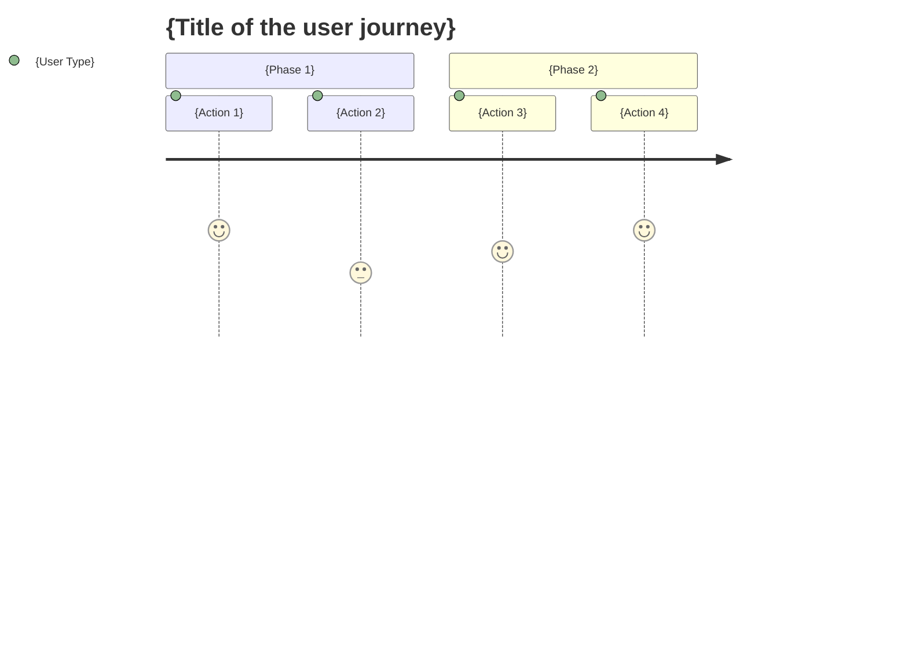

# kairo-requirements

## Objective

To analyze the requirements overview provided by the user and create a detailed requirements definition document including acceptance criteria using EARS (Easy Approach to Requirements Syntax).

## Prerequisites

- An overview of the requirements is provided by the user.
- The `docs/spec/` directory exists (if not, create it).

## Execution Content

**[Reliability Level Instruction]**:
For each item, please comment on the verification status with the original materials (including EARS requirements definition documents and design documents) using the following signals:

- 🟢 **Green Light**: When there is almost no guesswork and it is based on the EARS requirements definition document/design document.
- 🟡 **Yellow Light**: When it is a reasonable guess from the EARS requirements definition document/design document.
- 🔴 **Red Light**: When it is a guess not found in the EARS requirements definition document/design document.

1.  **Analyze Requirements**
    -   Understand the requirements overview provided by the user.
    -   Search for related existing requirements and design documents with @agent-symbol-searcher, and read the found files with the Read tool.
    -   Apply relevant domain knowledge.
    -   If there are any unclear points, supplement them based on general best practices.

2.  **Create User Stories**
    -   Describe in the format of WHO, WHAT, and WHY.
    -   Clarify the value of each feature.

3.  **Define Requirements using EARS Notation**
    -   **Ubiquitous (SHALL)**: Actions the system should normally perform.
    -   **Event-Driven (WHEN/IF-THEN)**: Actions under specific conditions.
    -   **Unwanted (WHERE)**: Actions in a specific state.
    -   **Optional (MAY)**: Optional features.
    -   **State-Driven (MUST)**: System constraints.

4.  **Define Edge Cases**
    -   Handling of abnormal cases.
    -   Handling of boundary values.
    -   Error handling.
    -   Performance requirements.

5.  **Create Files**
    -   `docs/spec/{requirement_name}-requirements.md`: Functional requirements and links to related documents.
    -   `docs/spec/{requirement_name}-user-stories.md`: Detailed user stories.
    -   `docs/spec/{requirement_name}-acceptance-criteria.md`: Acceptance criteria and test items.
    -   Create structured documents in markdown format.

## Example Output Format

### 1. requirements.md (main file)

```markdown
# {Requirement Name} Requirements Definition Document

## Overview

{Overview of the requirements}

## Related Documents

- **User Stories**: [📖 {requirement_name}-user-stories.md]({requirement_name}-user-stories.md)
- **Acceptance Criteria**: [✅ {requirement_name}-acceptance-criteria.md]({requirement_name}-acceptance-criteria.md)

## Functional Requirements (EARS Notation)

### Ubiquitous Requirements

- REQ-001: The system SHALL {normal_action}.
- REQ-002: The system SHALL {normal_action}.

### Event-Driven Requirements

- REQ-101: WHEN {condition}, the system SHALL {action}.
- REQ-102: IF {condition}, THEN the system SHALL {action}.

### State-Driven Requirements

- REQ-201: WHILE {state}, the system SHALL {action}.

### Optional Requirements

- REQ-301: The system MAY {optional_feature}.

### Unwanted Requirements (Constraints)

- REQ-401: The system MUST {constraint}.

## Non-functional Requirements

### Performance

- NFR-001: {Performance requirement}

### Security

- NFR-101: {Security requirement}

### Usability

- NFR-201: {Usability requirement}

## Edge Cases

### Error Handling

- EDGE-001: {Error case}

### Boundary Values

- EDGE-101: {Boundary value case}
```

### 2. user-stories.md (Detailed User Stories)

```markdown
# {Requirement Name} User Stories

## Overview

This document describes the detailed user stories for the {requirement_name} feature.

## User Type Definitions

### Primary Users

- **End User**: {Detailed description of the end user}
- **Administrator**: {Detailed description of the administrator}
- **Developer**: {Detailed description of the developer}

### Secondary Users

- **System Administrator**: {Detailed description of the system administrator}
- **External System**: {Detailed description of the external system}

## User Stories

### 📚 Epic 1: {Large feature group}

#### Story 1.1: {Specific story name}

**User Story**:
- **As a** {user_type}
- **in** {specific_situation_or_context}
- **I want to** {action_or_operation_to_be_realized}
- **so that** {value_gained_or_problem_solved}

**Detailed Description**:
- **Background**: {Why this feature is necessary}
- **Prerequisites**: {The situation that is a prerequisite for this story}
- **Usage Scene**: {Example of a specific usage scene}
- **Expected Experience**: {Details of the experience the user expects}

**Related Requirements**: REQ-001, REQ-002

**Priority**: High/Medium/Low

**Estimate**: {Story points or man-hours}

#### Story 1.2: {Specific story name}

{Describe in the same format}

### 📚 Epic 2: {Large feature group}

{Describe in the same format}

## User Journey

### Journey 1: {Representative usage flow}



**Details**:
1.  **{Action 1}**: {Detailed description}
2.  **{Action 2}**: {Detailed description}

## Persona Definitions

### Persona 1: {Representative user name}

- **Basic Information**: {Age, occupation, technical level, etc.}
- **Goal**: {What this user wants to achieve}
- **Challenge**: {The problem they are currently facing}
- **Behavior Pattern**: {Typical behavioral characteristics}
- **Usage Environment**: {Device used, environment, etc.}

## Non-functional User Requirements

### Usability Requirements

- **Learnability**: {Learning cost for first-time use}
- **Efficiency**: {Work efficiency after becoming proficient}
- **Memorability**: {Ease of remembering for reuse}
- **Error Handling**: {Ease of handling errors}
- **Satisfaction**: {Subjective satisfaction}

### Accessibility Requirements

- **Vision**: {Consideration for visually impaired users}
- **Hearing**: {Consideration for hearing-impaired users}
- **Motor**: {Consideration for users with motor impairments}
- **Cognitive**: {Consideration for users with cognitive impairments}
```

### 3. acceptance-criteria.md (Acceptance Criteria)

```markdown
# {Requirement Name} Acceptance Criteria

## Overview

This document describes the acceptance criteria and test items for the {requirement_name} feature.

## Functional Test Criteria

### REQ-001: Acceptance criteria for {requirement_name}

**Given**:
- {State before test execution}
- {Necessary initial data}

**When**:
- {Action to be executed}
- {Data to be input}

**Then**:
- {Expected output/state}
- {Side effects to be checked}

**Test Cases**:
- [ ] Happy path: {Details of the normal case}
- [ ] Sad path: {Details of the abnormal case}
- [ ] Boundary value: {Details of the boundary value test}

### REQ-002: Acceptance criteria for {requirement_name}

{Describe in the same format}

## Non-functional Test Criteria

### Performance Test

**NFR-001: {Performance requirement}**

- [ ] Response time: {Specific time standard}
- [ ] Throughput: {Processing amount standard}
- [ ] Concurrent connections: {Standard for the number of concurrent users}
- [ ] Resource usage: {Standard for CPU/memory usage}

**Test Method**:
- Load testing tool: {Tool to be used}
- Test scenario: {Specific test procedure}
- Pass criteria: {Quantitative pass line}

### Security Test

**NFR-101: {Security requirement}**

- [ ] Authentication: {Test items for the authentication feature}
- [ ] Authorization: {Test items for access control}
- [ ] Data protection: {Test items for data encryption}
- [ ] Vulnerability: {Test items for security vulnerabilities}

## Usability Test Criteria

### UX/UI Test

- [ ] Intuitive operation: {Clarity of operation}
- [ ] Responsive design: {Display on each device}
- [ ] Accessibility: {WCAG 2.1 compliance}
- [ ] Error messages: {Easy-to-understand error display}

**Test Method**:
- Usability test: {Implementation method}
- A/B test: {Method for comparative testing}
- Accessibility check: {Tool to be used}

## Edge Case Test Criteria

### EDGE-001: Acceptance criteria for {error_case}

**Test Scenario**:
- {Setting of the abnormal situation}
- {Expected error handling}
- {Appropriate notification to the user}

**Pass Criteria**:
- [ ] The system does not crash.
- [ ] An appropriate error message is displayed.
- [ ] Data integrity is maintained.
- [ ] A recoverable state is maintained.

## Integration Test Criteria

### System-to-System Integration Test

- [ ] External API integration: {Integration test with an external system}
- [ ] Database integration: {Test for the integrity of DB operations}
- [ ] File system: {Test for file operations}

## Regression Test Criteria

### Confirmation of Impact on Existing Features

- [ ] Confirmation of the operation of existing features: {Identification and confirmation of the scope of impact}
- [ ] Confirmation of performance degradation: {Performance confirmation of existing features}
- [ ] Confirmation of security settings: {Continued confirmation of security features}

## Acceptance Test Execution Checklist

### Before Test Execution

- [ ] Test environment preparation complete.
- [ ] Test data preparation complete.
- [ ] Test tool preparation complete.
- [ ] Confirmation of the person in charge of execution complete.

### During Test Execution

- [ ] Execution of all functional tests.
- [ ] Execution of all non-functional tests.
- [ ] Recording when problems are found.
- [ ] Re-testing after correction.

### After Test Completion

- [ ] Recording of test results.
- [ ] Organization of remaining problems.
- [ ] Judgment of acceptance.
- [ ] Reporting to stakeholders.
```

## Confirmation After Execution

-   Confirm the relevance of the created requirements with @agent-symbol-searcher.
-   Display the paths of the three created files.
    -   `docs/spec/{requirement_name}-requirements.md`
    -   `docs/spec/{requirement_name}-user-stories.md`
    -   `docs/spec/{requirement_name}-acceptance-criteria.md`
-   Report the number of major requirements and user stories.
-   Confirm that the links within each file are set correctly.
-   Display a message prompting the user for confirmation.
```
