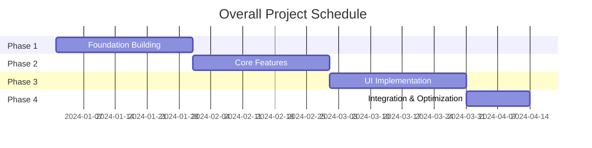

# kairo-tasks

## Objective

To divide implementation tasks into one-day granularities based on the design document and organize them into one-month phases. To create individual task files for each phase and manage them in an appropriate order considering dependencies.

## Prerequisites

- Design documents exist in `docs/design/{requirement_name}/`.
- The design has been approved by the user (or approval has been skipped).
- The `docs/tasks/` directory exists (if not, create it).

## Execution Content

**[Reliability Level Instruction]**:
For each item, please comment on the verification status with the original materials (including EARS requirements definition documents and design documents) using the following signals:

- 🟢 **Green Light**: When there is almost no guesswork and it is based on the EARS requirements definition document/design document.
- 🟡 **Yellow Light**: When it is a reasonable guess from the EARS requirements definition document/design document.
- 🔴 **Red Light**: When it is a guess not found in the EARS requirements definition document/design document.

1.  **Analyze Design Documents**
    -   Search for design documents with @agent-symbol-searcher, and read the found files with the Read tool.
    -   Read `docs/design/{requirement_name}/architecture.md` with the Read tool.
    -   Read `docs/design/{requirement_name}/database-schema.sql` with the Read tool.
    -   Read `docs/design/{requirement_name}/api-endpoints.md` with the Read tool.
    -   Read `docs/design/{requirement_name}/interfaces.ts` with the Read tool.
    -   Read `docs/design/{requirement_name}/dataflow.md` with the Read tool.

2.  **Check Existing Task Files**
    -   Search for existing task IDs with @agent-symbol-searcher, and read the found task files with the Read tool.
    -   Read existing `docs/tasks/{requirement_name}-*.md` files with the Read tool.
    -   Extract used task numbers (in TASK-0001 format).
    -   Assign non-duplicate numbers to new tasks.

3.  **Identify Tasks**
    -   Foundation tasks (DB settings, environment construction, etc.)
    -   Backend tasks (API implementation)
    -   Frontend tasks (UI implementation)
    -   Integration tasks (E2E tests, etc.)

4.  **Analyze Dependencies**
    -   Clarify dependencies between tasks.
    -   Identify tasks that can be executed in parallel.
    -   Identify the critical path.

5.  **Detail Tasks**
    Include the following for each task:
    -   Task ID (4-digit number in TASK-0001 format)
    -   Task Name
    -   Task Type (TDD/DIRECT)
        -   **TDD**: Development work such as coding, business logic implementation, UI implementation, test implementation, etc.
        -   **DIRECT**: Preparation work such as environment construction, configuration file creation, documentation creation, build settings, etc.
    -   Link to requirements
    -   Dependent tasks
    -   Implementation details
    -   Unit test requirements
    -   Integration test requirements
    -   UI/UX requirements (if applicable)
        -   Loading state
        -   Error display
        -   Mobile support
        -   Accessibility requirements

6.  **Sequence Tasks**
    -   Determine the execution order based on dependencies.
    -   Set milestones.
    -   Group tasks that can be executed in parallel.

7.  **Phase Division and File Creation**
    -   Divide tasks into phases of about one month.
    -   Create individual task files for each phase.
    -   `docs/tasks/{requirement_name}-overview.md`: Overall overview and phase list
    -   `docs/tasks/{requirement_name}-phase1.md`: Detailed tasks for Phase 1
    -   `docs/tasks/{requirement_name}-phase2.md`: Detailed tasks for Phase 2
    -   (Continue according to the number of phases)
    -   Design each task in one-day granularities.
    -   Add a checkbox to each task to make the task completion status trackable.

## Example Output Format

### 1. overview.md (Overall Overview)

````markdown
# {Requirement Name} Implementation Task Overall Overview

## Project Overview

- **Requirement Name**: {Requirement Name}
- **Total Period**: {Start Date} ~ {Scheduled End Date}
- **Total Man-hours**: {Man-hours}
- **Total Number of Tasks**: {Number}

## Phase Configuration

| Phase | Period | Major Deliverables | Task Count | Man-hours | File |
|---|---|---|---|---|---|
| Phase 1: Foundation Building | 1 month | Dev Environment, DB Settings | 20 tasks | 160h | [phase1.md](phase1.md) |
| Phase 2: Core Features | 1 month | Basic API, Authentication | 22 tasks | 176h | [phase2.md](phase2.md) |
| Phase 3: UI Implementation | 1 month | Screens, Components | 25 tasks | 200h | [phase3.md](phase3.md) |
| Phase 4: Integration & Optimization | 2 weeks | Testing, Performance Tuning | 10 tasks | 80h | [phase4.md](phase4.md) |

## Management of Existing Task Numbers

**Existing File Check Results**:
- Checked files: `docs/tasks/{requirement_name}-*.md`
- Used task numbers: TASK-0001 ~ TASK-0077 (example)
- Next start number: TASK-0078

## Dependencies



## Progress Management

### Overall Progress
- [ ] Phase 1: Foundation Building (0/20)
- [ ] Phase 2: Core Features (0/22)
- [ ] Phase 3: UI Implementation (0/25)
- [ ] Phase 4: Integration & Optimization (0/10)

### Milestones
- [ ] M1: Development environment complete (at the end of Phase 1)
- [ ] M2: MVP features complete (at the end of Phase 2)
- [ ] M3: UI complete (at the end of Phase 3)
- [ ] M4: Ready for release (at the end of Phase 4)

## Risk Management

| Risk | Impact | Probability | Countermeasure |
|---|---|---|---|
| {Risk Item} | High/Medium/Low | High/Medium/Low | {Countermeasure content} |

## Quality Standards

- Test Coverage: 90% or more
- Performance: Response time within 3 seconds
- Security: OWASP Top 10 compliance
- Accessibility: WCAG 2.1 AA compliance
````

### 2. phase*.md (Details of Each Phase)

````markdown
# {Requirement Name} Phase 1: Foundation Building

## Phase Overview

- **Period**: 1 month (20 business days)
- **Goal**: To build the development environment and database foundation.
- **Deliverables**: A working development environment, database schema, CI/CD foundation.
- **Person in Charge**: {Name of person in charge}

## Weekly Plan

### Week 1: Environment Construction
- **Goal**: To build the basic development environment.
- **Deliverables**: Docker environment, basic settings.

### Week 2: Database Design
- **Goal**: To implement the database schema.
- **Deliverables**: DB design, migrations.

### Week 3: CI/CD Construction
- **Goal**: To build an automation pipeline.
- **Deliverables**: Test and deployment automation.

### Week 4: Foundation Testing & Adjustment
- **Goal**: To stabilize the foundation.
- **Deliverables**: A foundation with confirmed operation.

## Daily Tasks

### Week 1: Environment Construction

#### Day 1 (TASK-0001): Project Initialization

- [ ] **Task Complete**
- **Estimated Man-hours**: 8 hours
- **Task Type**: DIRECT
- **Requirements Link**: REQ-001
- **Dependent Tasks**: None
- **Implementation Details**:
  - Node.js/TypeScript environment setup
  - package.json configuration
  - ESLint/Prettier configuration
  - Git initialization, .gitignore configuration
- **Completion Criteria**:
  - [ ] The development server starts with `npm run dev`.
  - [ ] No errors from `npm run lint`.
  - [ ] TypeScript configuration works correctly.
- **Points to Note**: Use the Node.js LTS version.

#### Day 2 (TASK-0002): Docker Environment Construction

- [ ] **Task Complete**
- **Estimated Man-hours**: 8 hours
- **Task Type**: DIRECT
- **Requirements Link**: REQ-002
- **Dependent Tasks**: TASK-0001
- **Implementation Details**:
  - Create Dockerfile
  - Configure docker-compose.yml
  - Configure PostgreSQL, Redis
  - Configure environment variable management
- **Completion Criteria**:
  - [ ] All services start with `docker-compose up`.
  - [ ] The application can connect to the DB.
  - [ ] Hot reloading works.
- **Points to Note**: Be careful of port conflicts.

#### Day 3 (TASK-0003): Basic Directory Structure

- [ ] **Task Complete**
- **Estimated Man-hours**: 6 hours
- **Task Type**: DIRECT
- **Requirements Link**: REQ-003
- **Dependent Tasks**: TASK-0002
- **Implementation Details**:
  - Create src/ directory structure
  - Test directory structure
  - Place configuration files
  - Create README.md
- **Completion Criteria**:
  - [ ] A structure that follows Clean Architecture.
  - [ ] Correct placement of test files.
  - [ ] A substantial README.md.
- **Points to Note**: Design carefully as this structure is difficult to change later.

#### Day 4 (TASK-0004): Logging & Error Handling Foundation

- [ ] **Task Complete**
- **Estimated Man-hours**: 8 hours
- **Task Type**: TDD
- **Requirements Link**: REQ-004
- **Dependent Tasks**: TASK-0003
- **Implementation Details**:
  - Winston/Pino logging library configuration
  - Error handling middleware
  - Structured logging configuration
  - Log rotation configuration
- **Test Requirements**:
  - [ ] Log output test
  - [ ] Error handling test
  - [ ] Log level control test
- **Completion Criteria**:
  - [ ] Logs of each level are output correctly.
  - [ ] Errors are caught appropriately.
  - [ ] Sensitive information is not output in the production environment.

#### Day 5 (TASK-0005): Configuration Management System

- [ ] **Task Complete**
- **Estimated Man-hours**: 6 hours
- **Task Type**: TDD
- **Requirements Link**: REQ-005
- **Dependent Tasks**: TASK-0004
- **Implementation Details**:
  - Configuration files for each environment
  - Configuration validation
  - Management of sensitive information
  - Configuration loading module
- **Test Requirements**:
  - [ ] Configuration loading test
  - [ ] Environment-specific configuration test
  - [ ] Configuration validation test
- **Completion Criteria**:
  - [ ] Environment variables are loaded correctly.
  - [ ] An error occurs with invalid settings.
  - [ ] Sensitive information is managed appropriately.

### Week 2: Database Design

#### Day 6 (TASK-0006): Database Connection Foundation

- [ ] **Task Complete**
- **Estimated Man-hours**: 8 hours
- **Task Type**: TDD
- **Requirements Link**: REQ-401
- **Dependent Tasks**: TASK-0005
- **Implementation Details**:
  - TypeORM/Prisma configuration
  - Connection pool configuration
  - Migration foundation
  - Database monitoring
- **Test Requirements**:
  - [ ] Connection pool test
  - [ ] Connection failure handling test
  - [ ] Transaction management test
- **Completion Criteria**:
  - [ ] The database connection is stable.
  - [ ] The connection pool works appropriately.
  - [ ] The migration command works.

{...Continued, describe in the same format for Days 7-20...}

## Phase Completion Criteria

- [ ] All tasks are complete (20/20).
- [ ] The development environment operates stably.
- [ ] The database schema is complete.
- [ ] The CI/CD pipeline works.
- [ ] The test coverage of the foundation code is 90% or more.
- [ ] The security check is complete.
- [ ] The documentation is prepared.

## Items to be Handed Over to the Next Phase

- How to use the development environment
- Details of the database schema
- How to operate CI/CD
- A list of configuration items
- Troubleshooting information

## Retrospective

### Differences from the Plan
- {Record the differences between the plan and the actual results}

### Lessons Learned
- {Record technical lessons learned}

### Points for Improvement
- {Record points to be improved in the next phase}
````

## Subtask Template

### For TDD Tasks

Each task is implemented with the following TDD process:

1.  `tdd-requirements.md` - Detailed requirements definition
2.  `tdd-testcases.md` - Test case creation
3.  `tdd-red.md` - Test implementation (failing)
4.  `tdd-green.md` - Minimal implementation
5.  `tdd-refactor.md` - Refactoring
6.  `tdd-verify-complete.md` - Quality confirmation

### For DIRECT Tasks

Each task is implemented with the following DIRECT process:

1.  `direct-setup.md` - Direct implementation/configuration
2.  `direct-verify.md` - Operational check/quality confirmation

```

## Confirmation After Execution

-   Check the consistency between the created tasks and the existing system with @agent-symbol-searcher.
-   Display a list of the created files.
    -   `docs/tasks/{requirement_name}-overview.md`: Overall overview and phase list
    -   `docs/tasks/{requirement_name}-phase1.md`: Phase 1 details
    -   `docs/tasks/{requirement_name}-phase2.md`: Phase 2 details
    -   (Continue according to the number of phases)
-   Display the overview and number of tasks for each phase.
-   Display the overall schedule and dependencies.
-   Report the project period and total man-hours.
-   **Display the confirmation results of existing task numbers**
    -   Used numbers extracted from existing files
    -   The number to start with for new tasks
    -   Confirmation of the assignment of consecutive numbers without duplicates
-   Display a message prompting the user to confirm the start of implementation.

## Confirmation of Links Between Files

-   Confirm that the links from overview.md to each phase*.md are set correctly.
-   Confirm that the task dependencies within each phase file are described correctly.
-   **Confirm that all task IDs are unified in the 4-digit TASK-0001 format.**
-   Confirm that milestones and phase completion criteria are clearly defined.

## Points to Note for Task Number Management

-   If there are existing files, be sure to check the used numbers with the Grep tool.
-   Supports up to 9999 tasks from TASK-0001 to TASK-9999.
-   Manage carefully to avoid duplicate or missing numbers.
-   Assign task numbers consecutively even if they span multiple phase files.
```
