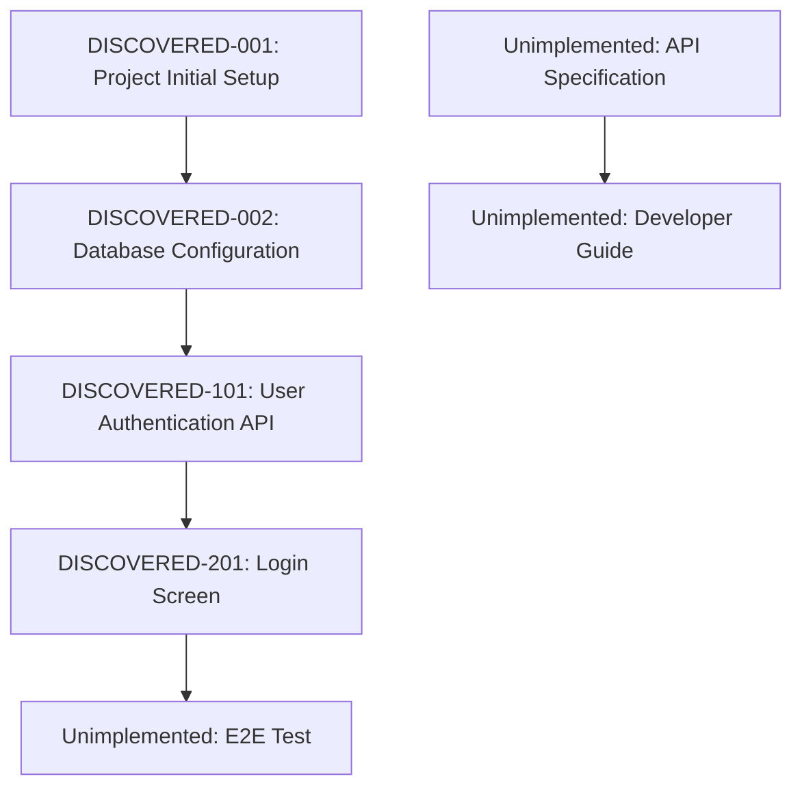

# rev-tasks

## Objective

To analyze an existing codebase, identify the implemented features, and organize them as a task list. To extract and document the structure, dependencies, and implementation details of tasks by reverse-calculating from the implemented features.

## Prerequisites

- The codebase to be analyzed exists.
- The `docs/reverse/` directory exists (if not, create it).
- Can analyze TypeScript/JavaScript, Python, and other code.

## Execution Content

1.  **Analyze the Codebase Structure**
    -   Grasp the directory structure.
    -   Check configuration files (package.json, tsconfig.json, requirements.txt, etc.).
    -   Analyze dependencies.

2.  **Identify Functional Components**
    -   Frontend components
    -   Backend services/controllers
    -   Database related (models, migrations)
    -   Utility functions
    -   Middleware

3.  **Extract API Endpoints**
    -   REST API endpoints
    -   GraphQL resolvers
    -   WebSocket handlers
    -   Routing definitions

4.  **Analyze the Database Structure**
    -   Table definitions
    -   Relationships
    -   Migration files
    -   Index settings

5.  **Analyze UI/UX Implementation**
    -   Screen components
    -   Implementation of state management
    -   Routing
    -   Styling method

6.  **Check Test Implementation**
    -   Presence of unit tests
    -   Presence of integration tests
    -   Presence of E2E tests
    -   Test coverage

7.  **Reverse-calculate and Organize Tasks**
    -   Decompose implemented features as tasks.
    -   Automatically assign task IDs.
    -   Estimate dependencies.
    -   Estimate implementation man-hours.

8.  **Create File**
    -   Save as `docs/reverse/{project_name}-discovered-tasks.md`.
    -   Document the discovered tasks in a structured way.

## Example Output Format

````markdown
# {Project Name} Discovered Task List

## Overview

**Analysis Date**: {Analysis execution date}
**Target Codebase**: {Path}
**Number of Discovered Tasks**: {Number}
**Estimated Total Man-hours**: {Hours}

## Codebase Structure

### Project Information
- **Framework**: {Framework used}
- **Language**: {Language used}
- **Database**: {DB used}
- **Major Libraries**: {Major dependencies}

### Directory Structure
```
{Directory tree}
```

## Discovered Tasks

### Foundation & Configuration Tasks

#### DISCOVERED-001: Project Initial Setup

- [x] **Task Complete** (Implemented)
- **Task Type**: DIRECT
- **Implementation Files**:
  - `package.json`
  - `tsconfig.json`
  - `.env.example`
- **Implementation Details**:
  - {Discovered configuration content}
- **Estimated Man-hours**: {Hours}

#### DISCOVERED-002: Database Configuration

- [x] **Task Complete** (Implemented)
- **Task Type**: DIRECT
- **Implementation Files**:
  - `src/database/connection.ts`
  - `migrations/001_initial.sql`
- **Implementation Details**:
  - {Discovered DB configuration content}
- **Estimated Man-hours**: {Hours}

### API Implementation Tasks

#### DISCOVERED-101: User Authentication API

- [x] **Task Complete** (Implemented)
- **Task Type**: TDD
- **Implementation Files**:
  - `src/auth/auth.controller.ts`
  - `src/auth/auth.service.ts`
  - `src/auth/jwt.strategy.ts`
- **Implementation Details**:
  - Login/logout feature
  - JWT token issuance
  - Authentication middleware
- **API Endpoints**:
  - `POST /auth/login`
  - `POST /auth/logout`
  - `POST /auth/refresh`
- **Test Implementation Status**:
  - [x] Unit Test: `auth.service.spec.ts`
  - [x] Integration Test: `auth.controller.spec.ts`
  - [ ] E2E Test: Not implemented
- **Estimated Man-hours**: {Hours}

### UI Implementation Tasks

#### DISCOVERED-201: Login Screen

- [x] **Task Complete** (Implemented)
- **Task Type**: TDD
- **Implementation Files**:
  - `src/components/Login/LoginForm.tsx`
  - `src/components/Login/LoginForm.module.css`
  - `src/hooks/useAuth.ts`
- **Implementation Details**:
  - Login form
  - Validation feature
  - Error handling
- **UI/UX Implementation Status**:
  - [x] Responsive design
  - [x] Loading state
  - [x] Error display
  - [ ] Accessibility: Partially implemented
- **Test Implementation Status**:
  - [x] Component Test: `LoginForm.test.tsx`
  - [ ] E2E Test: Not implemented
- **Estimated Man-hours**: {Hours}

## Unimplemented & Recommended Improvements

### Missing Tests

- [ ] **E2E Test Suite**: Test for major user flows.
- [ ] **Performance Test**: API response time test.
- [ ] **Security Test**: Authentication/authorization test.

### Code Quality Improvements

- [ ] **TypeScript Type Safety**: Use of the `any` type in some places.
- [ ] **Error Handling**: Unified error handling.
- [ ] **Logging**: Implementation of structured logging.

### Lack of Documentation

- [ ] **API Specification**: OpenAPI/Swagger not implemented.
- [ ] **Developer Guide**: Setup procedure manual.
- [ ] **Deployment Procedure Manual**: Production environment construction procedure.

## Dependency Map



## Implementation Pattern Analysis

### Architectural Patterns
- **Implementation Pattern**: {Discovered pattern}
- **State Management**: {State management used}
- **Authentication Method**: {Implemented authentication method}

### Coding Style
- **Naming Conventions**: {Discovered naming conventions}
- **File Structure**: {File structure pattern}
- **Error Handling**: {Error handling pattern}

## Technical Debt & Improvement Points

### Performance
- {Discovered performance issues}

### Security
- {Discovered security issues}

### Maintainability
- {Discovered maintainability issues}

## Recommended Next Steps

1.  **Implement Missing Tests** - Especially the E2E test suite.
2.  **Prepare Documentation** - API specification and setup guide.
3.  **Improve Code Quality** - TypeScript type safety and error handling.
4.  **Strengthen Security** - Detailed review of authentication/authorization.

````

## Automatic Detection of Files to be Analyzed

### Frontend
- React: `*.tsx`, `*.jsx`, `*.ts`, `*.js`
- Vue: `*.vue`, `*.ts`, `*.js`
- Angular: `*.component.ts`, `*.service.ts`, `*.module.ts`

### Backend
- Node.js: `*.ts`, `*.js` (Express, NestJS, etc.)
- Python: `*.py` (Django, FastAPI, etc.)
- Java: `*.java` (Spring Boot, etc.)

### Database
- SQL: `*.sql`, `migrations/*`
- ORM: Model files, configuration files

### Configuration Files
- `package.json`, `tsconfig.json`, `webpack.config.js`
- `requirements.txt`, `Pipfile`, `pyproject.toml`
- `pom.xml`, `build.gradle`

## Example Execution Commands

```bash
# Analyze the current directory
claude code rev-tasks

# Analyze a specific directory
claude code rev-tasks --path ./backend

# Analyze focusing on a specific tech stack
claude code rev-tasks --tech react,nodejs

# Detailed analysis (including test coverage, etc.)
claude code rev-tasks --detailed

# Specify the output format
claude code rev-tasks --format json
```

## Confirmation After Execution

-   Display the number of discovered tasks and the estimated man-hours.
-   Display a list of implemented/unimplemented features.
-   Display a summary of technical debt and recommended improvements.
-   Propose the next reverse engineering step (design document generation, etc.).
```
